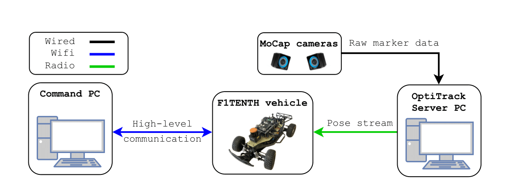
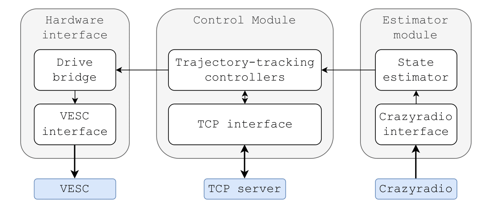

# Lab architecture

The AiMotionLab autonomous vehicle test area at HUN-REN SZTAKI has been developed to evaluate various motion planning and control algorithms in the field of autonomous mobile robotics. The ground vehicle test environment ,  of the lab consists of three main components. First, F1TENTH vehicles are used as the autonomous vehicle platform in the experiments. For indoor localization, the lab utilizes a high-precision motion-capture (MoCap) system. Finally, a desktop “Command PC” is used as a communication interface for the cars and other lab components to send high-level commands, such as reference trajectories for the vehicle. The overall architecture of the lab is depicted in Figure 1.

Architecture of the AiMotionLab vehicle test area.

## F1TENTH vehicle

The F1TENTH vehicle  is a 1/10 scale autonomous car-like mobile platform. It is developed and maintained by the F1TENTH community  . The hardware components of the vehicles are defined by a ruleset , to ensure that the platforms have similar specifications, which is important in the autonomous racing context. Furthermore, the community also provides an open-source development environment for the vehicles.

The platform is built on top of a modified *Traxxas Slash 4x4 Ultimate* chassis  . A *SurpassHobby Rocket V3 21.5T Sensored Brushless* motor  is used with the stock *Traxxas* torque servo for powering the vehicle. The motor and the servo are actuated by a *VESC 6MK VI* electronic speed controller . The VESC is responsible for the low-level control of the motor and the servo, furthermore, it also contains a built-in IMU sensor, which can be used for the state estimation. The main computation unit of the vehicle is an *Nvidia Jetson Orin Nano Developer Kit* , which is connected to the VESC board via serial communication. Furthermore, a *Crazyradio PA* dongle  is connected to the board via USB to ensure low-latency communication between the vehicle and the OptiTrack server PC for time-critical information, such as the position estimates. For other data, where latency and determinism are not a prominent issue, WiFi communication is utilized. The vehicle and its main components are displayed in Figure 2.

The F1TENTH autonomous ground vehicle platform.

The Jetson board runs the JetPack 6.0 SDK, which provides a Linux-based operating system for development. Similarly to the original onboard software stack provided by the F1TENTH community, our implementation is also based on the ROS2 ecosystem. However, to address the specific requirements and conditions of the AiMotionLab environment, the stock software components have been redesigned.

The overall architecture of the onboard software stack is outlined in Figure 3. As the figure shows, the onboard software consists of three external interfaces. The `Crazyradio interface` manages the radio connection with the MoCap server and receives the high-precision position and orientation estimates. Using this pose data, the `State estimator` computes the states of the vehicle through numerical differentiation. The `TCP interface` is responsible for the high-level communication with the Command PC. When a reference trajectory is sent to the vehicle through this interface, the `Control module` activates the selected trajectory-tracking controller and begins execution. During execution, the controller uses state estimates from the `Estimator module` to calculate control inputs. These inputs are then sent to the `Drive bridge`, which converts them into a format compatible with the VESC. Finally, the `VESC` interface forwards the inputs to the actuators.

The onboard software stack of the vehicle.

## Motion-capture system

The main localization unit used in the test environment is an OptiTrack motion-capture system, which consists of 14 *OptiTrack Prime X 13*  cameras and a server PC. The server PC runs the Motive  software and is responsible for the management of the cameras and the configuration of the MoCap system. The vehicles are equipped with reflective markers in a unique configuration to be recognizable by the MoCap system. The cameras detect the reflective markers and forward the measured information to the MoCap server. Using the incoming data from the cameras, the server reconstructs the position and orientation data of the selected objects and broadcasts this information through the local network at 120 Hz. As the vehicles require low-latency and deterministic pose data for the state estimation, instead of the unreliable WiFi connection, we utilize radio communication to send the MoCap information to the vehicles.

If calibrated correctly, the MoCap system provides submillimeter precision position and orientation data at a high framerate, therefore, we can solely rely on the pose data and numerical differentiation to calculate the velocities of the vehicles. Thus, throughout the experimental studies, we exclusively rely on measurements from the MoCap system. However, it is important to note that this approach limits the test environment to the area captured by the cameras. Extending the test area would be possible by utilizing additional sensors such as LiDARs and IMUs and sensor fusion techniques. However, the configuration and implementation of state estimation techniques with such complexity are beyond the scope of this thesis.

## Command PC

Finally, the Command PC is responsible for the high-level management of the vehicles in the lab. In order to control the vehicles without any platform-specific dependencies, we have constructed an API package written in Python that leverages TCP communication to send commands and retrieve data from the vehicles. By using this high-level API, users can send trajectories to the cars, set and modify parameters for the onboard software stack of the vehicle, and request logged information for fast and efficient evaluation. The API together with the onboard stack is available at the following GitHub repository: [https://github.com/AIMotionLab-SZTAKI/AIMotionLab-F1TENTH](https://github.com/AIMotionLab-SZTAKI/AIMotionLab-F1TENTH).
